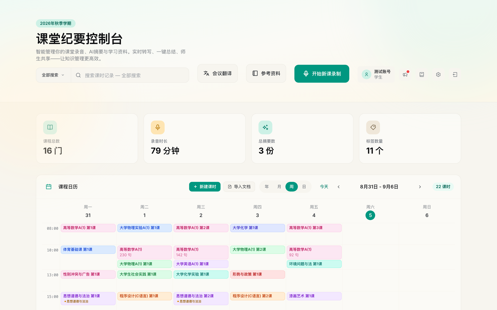
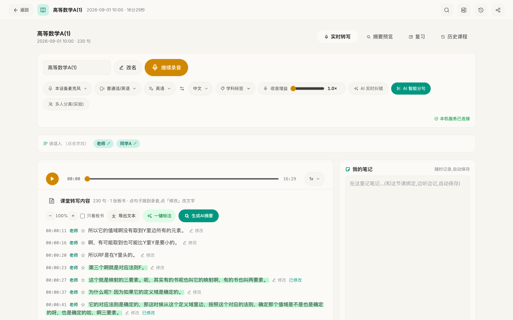
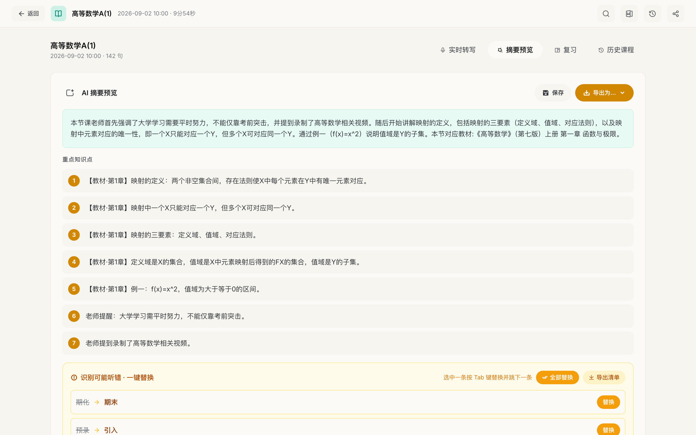
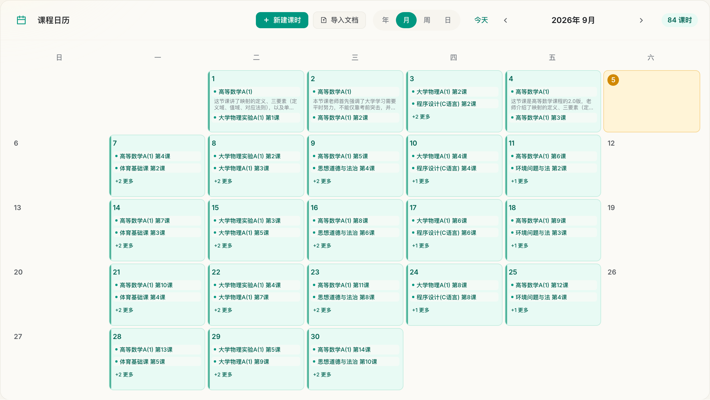
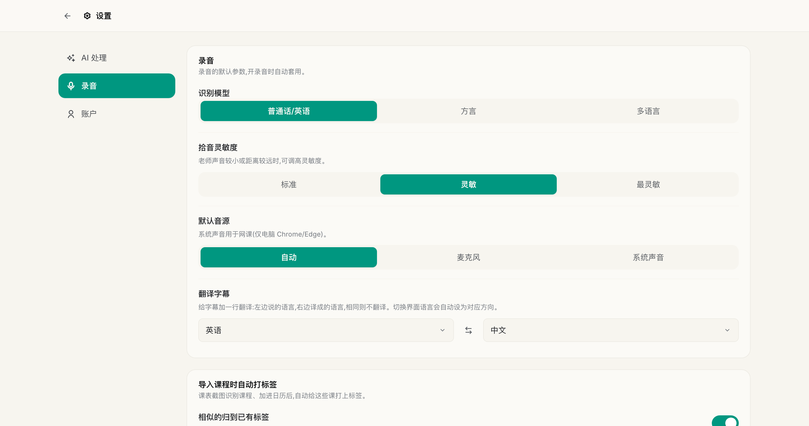
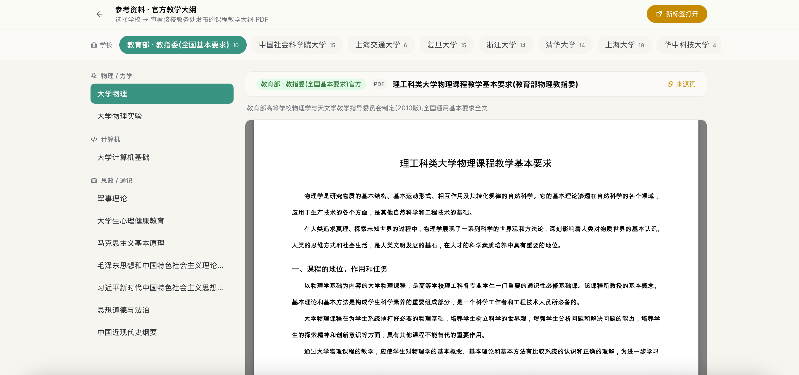

# eeclass — Classroom Real-time Captions & Notes

**English** | [中文](README.zh.md)

> **Turn a live lecture into a clean, structured, searchable, review-ready notebook — in real time — while your audio never leaves your own machine.**

eeclass is a **self-hosted** classroom transcription & AI-notes system. The teacher lectures; it renders live captions, tells speakers apart, and marks key points — all on your own CPU. Afterwards it uses an LLM to generate summaries, likely exam points, and mock papers to help you revise. Speech recognition, speaker separation and voiceprints all run **locally; audio never leaves the device** — only optional plain-text calls (correction/summary) go to an external LLM.

Built for Chinese university classrooms, but the recognizer is multilingual (zh / en / ja / ko / yue).

## Screenshots

<p align="center">
  
</p>

<table>
  <tr>
    <td width="50%"><br><sub><b>Live transcription</b> — speaker labels, inline English→Chinese subtitles, notes side by side; everything runs on-device.</sub></td>
    <td width="50%"><br><sub><b>AI summary</b> — per-class summary, key points, and one-tap homophone fixes.</sub></td>
  </tr>
  <tr>
    <td width="50%"><br><sub><b>Weekly schedule</b> — timetable import with per-course color coding.</sub></td>
    <td width="50%"><br><sub><b>Settings</b> — toggle real-time correction, smart segmentation and translation.</sub></td>
  </tr>
</table>

<p align="center">
  <br>
  <sub><b>Official syllabus library</b> — browse ministry &amp; university course outlines (PDF) right inside the app.</sub>
</p>

---

## Who it's for

- **University students** — who can't take notes fast enough and keep missing content; who want a complete, searchable, revisable record of every class.
- **Teachers** — who want a verbatim record of their own lectures, plus automatic per-class and whole-course summaries.
- **Deaf / hard-of-hearing & non-native students** — who need live captions, or a Chinese subtitle auto-added under English speech.
- **Privacy-conscious people & institutions** — who won't upload classroom audio to a third-party cloud and want to own their data end to end.

## Problems it solves

- **Can't keep up taking notes, miss the key parts** — everything is transcribed automatically, with the points/definitions/formulas the teacher stresses highlighted.
- **Nothing to revise from after class** — one tap generates a per-class summary, a whole-course "grand summary", exam-point prediction, a mock exam, and self-test flashcards.
- **ASR mishears homophones and leaves choppy fragments** — real-time homophone correction + smart segmentation turn broken speech into readable sentences (both are built to **never drop a word**).
- **Content scattered across many classes, hard to find** — full-text search across every course ("which class did the teacher mention X?").
- **Privacy concerns with cloud transcription** — audio, recognition and voiceprints all run locally on CPU; nothing is uploaded.

## Typical scenarios

1. **In class**: bring an iPad / laptop, hit start → live captions, teacher-vs-student separation, mark highlights, snap the board (aligned to the timeline).
2. **After class**: read the class summary; open the course view for a whole-course **grand summary / exam-point prediction / mock paper**; self-test with flashcards; **ask questions** about the whole lecture.
3. **Revise / find material**: full-text search down to a single sentence; export PDF; replay an English class with the Chinese subtitles already attached.
4. **Cross-device**: record on the **native iPad app** in class, revise on the **web app** on your phone/computer — same backend, same data.

## Highlights

- 🔒 **Fully local, audio never leaves the device** — ASR, speaker separation and voiceprints all run on CPU (sherpa-onnx SenseVoice, RTF ≈ 0.05); only optional text correction/summary goes to an external LLM.
- 🧬 **A voiceprint library that recognizes people** — name someone once and future recordings of the same voice are recognized automatically; each person is stored once, and renaming propagates **back across all past classes**.
- 🧠 **Course-level AI** — beyond per-class summaries, it **aggregates a whole course's classes into a grand summary**, predicts exam points (with a share pie chart), and generates a mock paper.
- 📱 **One codebase, many devices** — web app + native iPad app (Capacitor), from the single `mobile/` source.
- 🌏 **Multilingual + auto-translation** — zh/en/ja/ko/yue recognition; English lines get a Chinese subtitle underneath automatically.
- 🏠 **Self-hosted, open source (MIT)** — runs on one ordinary machine + a LAN; your data stays entirely in your hands.
- 📖 **Built-in animated manual** — every feature ships with a CSS-animated demo + step-by-step guide; zero learning curve.

## Features

- **Real-time transcription** — streaming captions with punctuation, CPU-only (sherpa-onnx SenseVoice, ~0.05 RTF).
- **Speaker separation + voiceprint library** — tells speakers apart on the fly; name a person once and future recordings recognize the same voice. Same person is stored once (deduplicated), and renaming propagates back across past classes.
- **Highlight detection** — auto-marks key points, definitions and formulas the teacher stresses.
- **AI assist (via DeepSeek, optional)** — homophone correction, smart sentence segmentation, English→Chinese subtitles, per-class summary, whole-course grand summary, exam-point prediction, mock exam, flashcards / quiz, and "ask the lecture" Q&A.
- **Board capture** — snap the blackboard/slide; shots are aligned to the timeline.
- **Accounts & privacy** — real login (pbkdf2), strict per-account data isolation, admin-only voiceprint management, read-only share links.
- **Export** — PDF export; live write-into-Word via an Office add-in (Windows only).
- **Timetable & syllabus**, full-text search across classes, editable transcripts, light/dark theme, mic sensitivity.
- **Optional Aliyun OSS** offload/backup for audio and files.

## How it works

```
Web / iPad app / Word add-in ──WSS──►  Python backend (aiohttp, HTTPS :5901)
                                        ├─ sherpa-onnx SenseVoice   (ASR, CPU)
                                        ├─ silero VAD               (segmentation)
                                        ├─ 3D-Speaker eres2netv2    (voiceprints)
                                        ├─ PostgreSQL   (accounts / sessions / class metadata)
                                        ├─ records/     (audio / transcripts / board shots, files)
                                        └─ DeepSeek API (text only, optional)
```

- **Frontend / mobile** — React 19 + Vite + TypeScript + Tailwind (`frontend/` desktop web, `mobile/` mobile); `mobile/` builds both the web `/m` app and, via Capacitor, the native iPad app.
- **Backend** — Python + aiohttp (`backend/service/`). Accounts, sessions and class metadata live in PostgreSQL; audio, per-line transcripts and board shots are files under `records/`, referenced by the DB.
- **Word add-in** — Office.js task pane (`backend/addin/`), Windows only.

## Requirements

- Python 3.11+, Node.js 18+, ffmpeg, PostgreSQL 14+
- ~2 GB disk for speech models (downloaded on first setup)
- A DeepSeek API key for the AI features (optional; transcription works without it)

## Quick start

### macOS

```bash
bash setup-mac.sh          # installs node/python/ffmpeg + deps, downloads ~2GB models
```

### Windows

```powershell
backend\scripts\install.ps1     # deps + models
backend\scripts\start.ps1       # start the backend
```

### Configure

```bash
cp backend/service/config.example.json backend/service/config.json
```

Provide your DeepSeek key and DB connection string via environment variables (preferred — keeps them out of files):

```bash
export DEEPSEEK_API_KEY=sk-your-key
export EECLASS_DB_DSN=postgresql:///eeclass   # local peer auth, no password
```

Speech recognition runs without a key; only the AI-assist features need it.

## Run (development)

Two terminals:

```bash
# A — backend (recognition service, HTTPS on :5901)
cd backend
DEEPSEEK_API_KEY=sk-your-key ./.venv/bin/python service/server.py

# B — frontend (hot reload on :3000)
cd frontend
npm run dev
```

Open **http://localhost:3000/course**. The frontend auto-detects dev mode and talks to the backend on `localhost:5901`.

## Build & serve (single origin / LAN / phones)

```bash
cd frontend && BASE_PATH=/app/ npm run build     # desktop → out/
cd mobile   && BASE_PATH=/     npm run build      # mobile  → out/ (serves /m and the iPad app)
```

The backend then serves the desktop app at **https://localhost:5901/app/course** and the mobile app at `/m`. On the same Wi-Fi, phones/tablets can open `https://<your-LAN-ip>:5901/app/course` (self-signed cert — accept the warning). Access is gated by a token when `server.require_token` is on.

## Privacy & security

- **Audio, ASR, speaker voiceprints — all local, on CPU.** Speech never leaves the machine.
- Only optional **text** (transcript snippets for correction/summary) is sent to DeepSeek.
- Passwords stored as pbkdf2 hashes; sessions are token-based; brute-force lockout on the token gate.
- **Strict per-account data isolation** — each account only sees its own classes, courses, schedule and voiceprint library.
- Secrets (`config.json`, `token.txt`, `certs/`, env vars in `start-server.sh`), all user data (`records/`) and the models are **git-ignored** and never committed. Put the DB DSN and API keys in environment variables, not in files.

## Project layout

```
frontend/                  Desktop web frontend (React + Vite + TS + Tailwind)
mobile/                    Mobile app (same stack; builds web /m + Capacitor iPad app)
backend/
  service/                   Backend (Python, aiohttp, sherpa-onnx, PostgreSQL, DeepSeek)
    config.example.json      Copy to config.json and edit
    db.py / migrate_to_db.py PostgreSQL connection + JSON→DB migration script
    models/                  Speech models (downloaded, git-ignored)
  addin/                     Word Office.js task pane (Windows)
  records/                   User data (git-ignored)
  scripts/                   install.ps1 / start.ps1 (Windows)
setup-mac.sh                 One-shot dev setup for macOS
```

## Models & licensing

Speech models are downloaded from the [sherpa-onnx](https://github.com/k2-fsa/sherpa-onnx) releases (SenseVoice ASR, CT-Transformer punctuation) and [3D-Speaker](https://github.com/modelscope/3D-Speaker) (eres2netv2 voiceprint), plus silero VAD. They are not redistributed here — the setup script fetches them, and each carries its own upstream license.

## License

[MIT](LICENSE) © 2026 dtee
